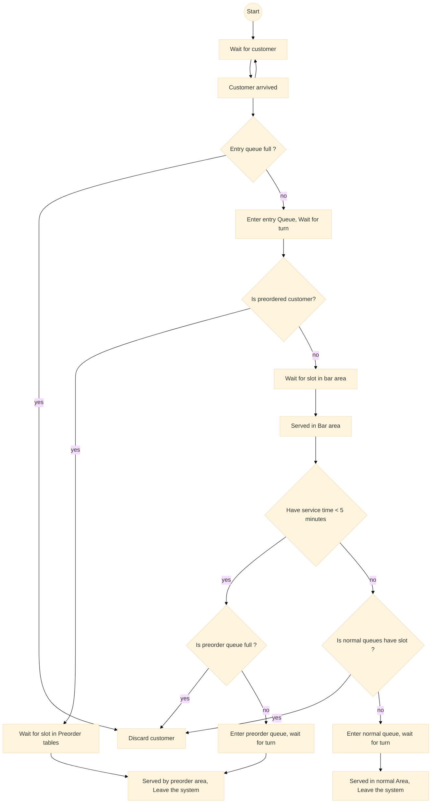

```mermaid
%%{init: {'theme': 'base', "flowchart" : { "curve" : "basis" } } }%%
flowchart TD
    Start((Start)) --> Wait
    Wait[Wait for customer] --> Arrive[Customer arrvived]
    Arrive --> Wait
    Arrive --> QueueFull{Entry queue full ?}
    QueueFull --> |yes| DiscardEntry[Discard customer]
    QueueFull --> |no| EnteredQueue[Enter entry Queue, Wait for turn]
    EnteredQueue --> Preorder{Is preordered customer?}
    Preorder --> |yes| WaitPreoderArea[Wait for slot in Preorder tables]
    WaitPreoderArea --> PreorderArea
    Preorder --> |no| WaitBarArea[Wait for slot in bar area]
    WaitBarArea --> ServedBarArea[Served in Bar area]
    ServedBarArea --> LowServiceTime{Have service time < 5 minutes}
    LowServiceTime --> |yes|QueueFullPreorder{Is preorder queue full ?}
    QueueFullPreorder --> |yes|DiscardEntry
    QueueFullPreorder --> |no|PreorderQueue[Enter preorder queue, wait for turn]
    PreorderQueue --> PreorderArea[Served by preorder area, Leave the system]
    LowServiceTime --> |no|NormalQueueFull{Is normal queues have slot ?}
    NormalQueueFull --> |yes| DiscardEntry
    NormalQueueFull --> |no| NormalQueue[Enter normal queue, wait for turn]
    NormalQueue --> NormalArea[Served in normal Area, Leave the system]
```